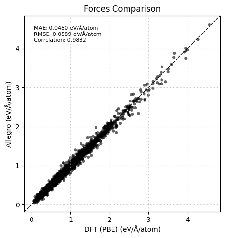
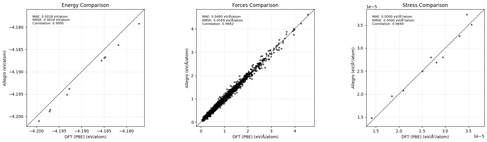
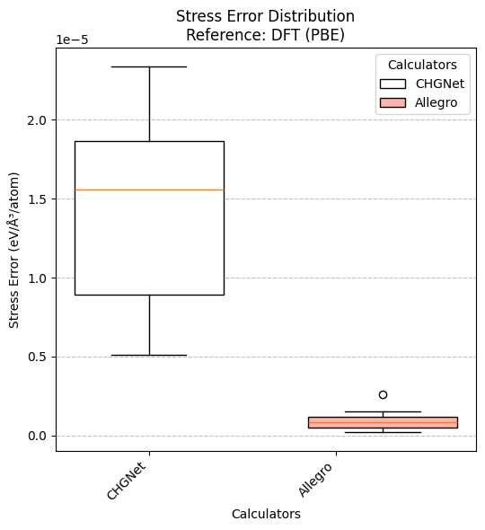
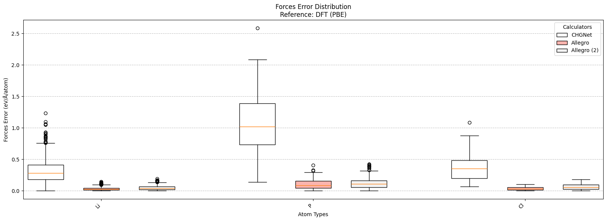
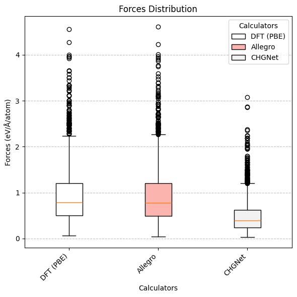
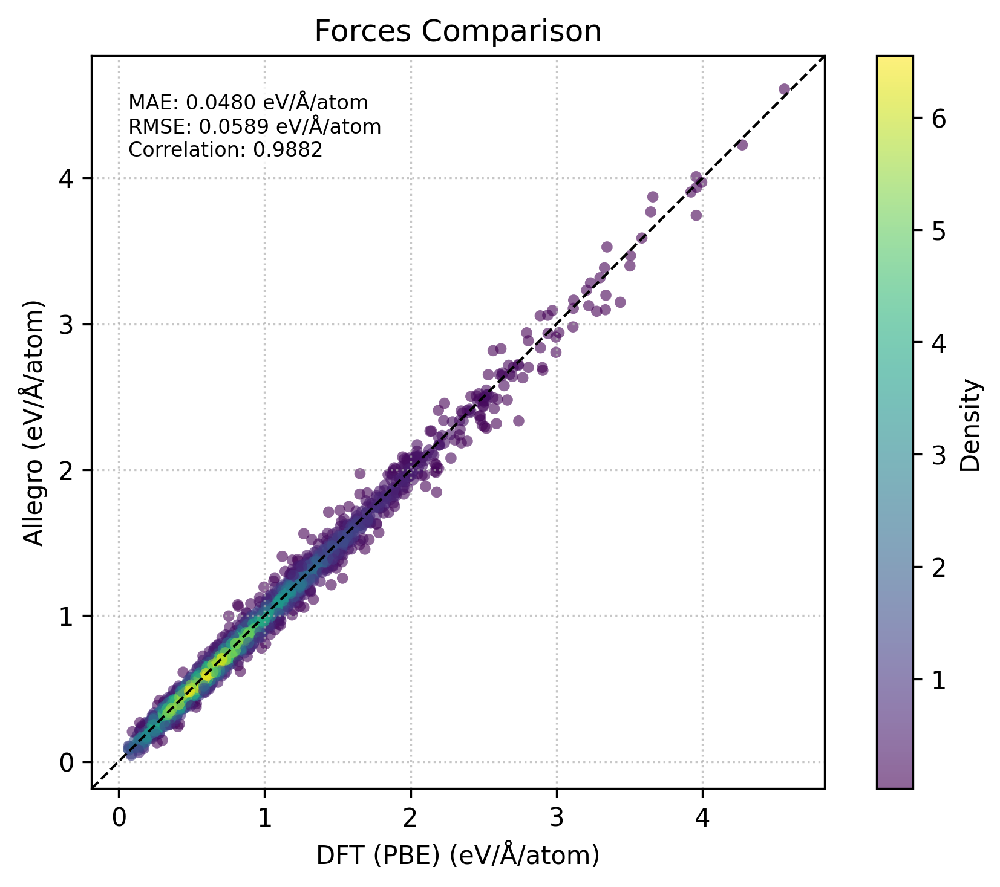

# **sim_eval**

*V1 is here!!! Thanks Joel for being a great tester!*

sim_eval is a Python library for analyzing, quantifying, and comparing molecular simulation calculation errors. It is designed to benchmark machine learning potentials against reference calculations, such as those from VASP DFT.

# Key Features

- Load and Process Frames: Supports molecular dynamics frames in any ASE-supported format.
- Compare Predictions: Evaluate energy, forces, and stress predictions against reference methods.
- Error Metrics: Calculate MAE, RMSE, and correlation metrics.
- Publication-Quality Plots: Generate plots for easy comparison and analysis.

## Supported Calculators

- NequIP / Allegro: Machine learning potentials.
- VASP: Single and multiple OUTCAR files, XML outputs.
- CHGnet: Property calculator.
- MACE: (Currently untested).
- ASE Calculators: Compatible with any ASE-supported calculator.

## Supported Properties

```python
'energy' # Per atom energy or per structure energy (eV/atom or eV/structure)
'forces' # Per atom forces or per structure forces (eV/Å/atom or eV/Å/structure)
'stress' # Per atom structure stress (eV/Å^3) 
```

Only 'forces' has true per atom support, the other properties are per structure and are divided by the number of atoms in the structure.

# Installation

To install sim_eval directly from GitHub, run:
```bash
pip install git+https://github.com/ChrisDavi3s/sim_eval.git
```

To install in editable mode, clone the repository and run:
```bash
git clone https://github.com/ChrisDavi3s/sim_eval.git
cd sim_eval
pip install -e .
```

# Usage

## Quick Start

Here's a simple example to get you started:

```python

from sim_eval import Frames, VASPXMLPropertyCalculator, NequIPPropertyCalculator
from sim_eval import Plotter

# Load Frames
frames = Frames('example_frames.extxyz')

# Set up calculators
vasp_calc = VASPXMLPropertyCalculator('DFT (PBE)', '31_vaspout_xml_frames', 'vasprun_frame')
nequip_calc = NequIPPropertyCalculator('Allegro', 'nequip_model.pth')

# Add data from calculators
frames.add_method_data(vasp_calc)
frames.add_method_data(nequip_calc)

# Print Metrics
Plotter.print_metrics(frames, ['energy', 'forces'], vasp_calc, nequip_calc)

# Generate Plots
Plotter.plot_scatter(frames, 'forces', vasp_calc, nequip_calc, per_atom = True)
```
**Please look at the example notebook for a more detailed example.**

## Advanced Plotting

The new Plotter class provides a unified interface for creating various plots. All plots return a matplotlib figure object, which can be further customized or saved:

1) Print Metrics: Print MAE, RMSE, and correlation metrics.
2) Scatter Plots: Compare reference and target data.
3) Box Plots: Visualize error distributions.
4) Property Distribution: Analyze property values across calculators without comparison.

### Print Metrics
**Print out metrics when comparing calculators against some reference.**

```python
Plotter.print_metrics(frames = frames,
                      property_name= ['energy','forces'], 
                      reference_calculator = vasp_calc, 
                      target_calculators = [chgnet_calc,nequip_calc], 
                      per_atom=False)
```

```bash
Energy Metrics (vs DFT (PBE)):
----

  CHGNet:
    MAE: 269.3705 eV/structure
    RMSE: 269.3722 eV/structure
    Correlation: 0.8821

  Allegro:
    MAE: 0.3789 eV/structure
    RMSE: 0.3840 eV/structure
    Correlation: 0.9995

Forces Metrics (vs DFT (PBE)):
----

  CHGNet:
    MAE: 93.4327 eV/Å/structure
    RMSE: 93.5809 eV/Å/structure
    Correlation: 0.8346

  Allegro:
    MAE: 1.7029 eV/Å/structure
    RMSE: 2.0822 eV/Å/structure
    Correlation: 0.9920
```

for a more advanced example, you can also print the metrics per atom species for the forces property:
```python
Plotter.print_metrics(frames = frames, 
                      property_name = ['energy','forces'], 
                      reference_calculator = vasp_calc, 
                      target_calculators = [chgnet_calc,nequip_calc], 
                      per_atom=[False,True], 
                      group_per_species=True)
```

```bash
Energy Metrics (vs DFT (PBE)):
----

  CHGNet:
    MAE: 269.3705 eV/structure
    RMSE: 269.3722 eV/structure
    Correlation: 0.8821

  Allegro:
    MAE: 0.3789 eV/structure
    RMSE: 0.3840 eV/structure
    Correlation: 0.9995

Forces Metrics (vs DFT (PBE)):
----

  CHGNet:
    MAE: 0.4548 eV/Å/atom
    RMSE: 0.5253 eV/Å/atom
    Correlation: 0.8243

    Per Atom Type:
    Li:
      MAE: 0.3089 eV/Å/atom
      RMSE: 0.3544 eV/Å/atom
      Correlation: 0.9085
    P:
      MAE: 1.0422 eV/Å/atom
      RMSE: 1.1252 eV/Å/atom
      Correlation: 0.8445
    S:
      MAE: 0.5326 eV/Å/atom
      RMSE: 0.6355 eV/Å/atom
      Correlation: 0.6975
      ...
      ...
      ...
```

### Scatter Plots

**Compare the values of two calculators for a given property.**

```python
Plotter.plot_scatter(frames, 'forces', vasp_calc,  nequip_calc , per_atom=True)
```


And plotting several properties at once:
```python
Plotter.plot_scatter(frames = frames, 
                    property_name = ['energy', 'forces', 'stress'], 
                    reference_calculator = vasp_calc, 
                    target_calculator = nequip_calc, 
                    per_atom= [True, True, True])
```



property_name: str,
    reference_calculator: PropertyCalculator,
    target_calculators: PropertyCalculator | List[PropertyCalculator],
    per_atom: bool = False,
    frame_number: int | slice = slice(None),
    group_spacing: float = 1,
    box_spacing
### Box Plots
**Compare the distribution of two calculators for a given property.**

```python
Plotter.plot_box(frames = frames, 
                 property_name = 'stress', 
                 reference_calculator = vasp_calc, 
                 target_calculators = [chgnet_calc, nequip_calc], 
                 per_atom=True,
                 legend_location='upper right')
```


If looking at forces, you can also group per atom forces by species:
```python
Plotter.plot_box(frames=frames, 
                 property_name= 'forces', 
                 reference_calculator=vasp_calc, 
                 target_calculator=[chgnet_calc, nequip_calc, second_nequip_calc], 
                 per_atom=True, 
                 legend_location='upper right', 
                 group_per_species=True, 
                 allowed_species=['Li', 'P', 'Cl'])
```



### Property Distribution

**Plot the raw disribution of a calculator.**

```python
Plotter.plot_property_distribution(frames = frames, 
                                  property_name = 'forces', 
                                  calculators = [vasp_calc, nequip_calc, chgnet_calc], per_atom=True, 
                                  legend_location='upper right')
```


### Modifying plots

Every plot returns a matplotlib figure object, which can be further customized or saved. For example:

```python
import matplotlib.pyplot as plt
from matplotlib.colors import Normalize
from scipy.stats import gaussian_kde

# Create the scatter plot
fig,ax = Plotter.plot_scatter(frames, 'forces', vasp_calc,  nequip_calc , per_atom=True)

# Get the scatter plot from the axis
scatter = ax.collections[0]  

# Extract the data from the scatter plot
offsets = scatter.get_offsets()
x, y = offsets[:, 0], offsets[:, 1]

# Calculate the point density
xy = np.vstack([x, y])
z = gaussian_kde(xy)(xy)

# Normalize the density values for coloring
norm = Normalize(vmin=z.min(), vmax=z.max())

# Update the scatter plot with the new colors
scatter.set_array(z)
scatter.set_cmap('viridis')  # Choose a colormap
scatter.set_norm(norm)

# Add a colorbar to the plot
plt.colorbar(scatter, ax=ax, label='Density')

# Display the modified plot
# make the fig high res 
fig.set_dpi(300)
fig
```



# Testing

The project includes a CI pipeline that runs tests on every push. Tests are written using the unittest module. To run the tests, navigate to the root directory and execute:

```bash
python -m unittest discover
```

# Contributing

Contributions are welcome! Please open an issue to discuss any major changes. Ensure that tests are updated as appropriate.

